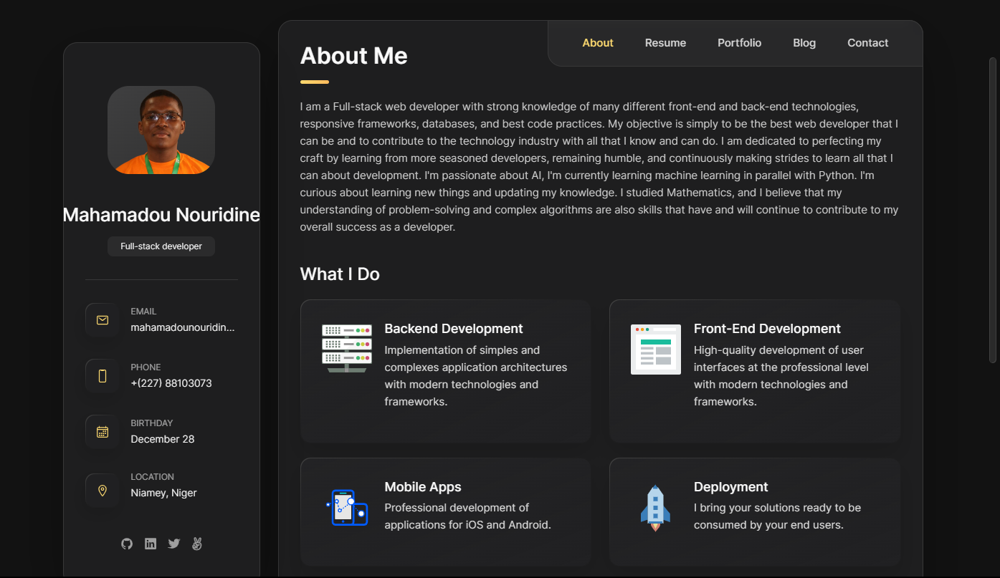

<a name="readme-top"></a>

<div align="center">
  <h1><b>Personal Portfolio</b></h1>

</div>

<!-- TABLE OF CONTENTS -->

# 📗 Table of Contents

- [📗 Table of Contents](#-table-of-contents)
- [📖 Personal Portfolio ](#-personal-portfolio-)
  - [🛠 Built With ](#-built-with-)
    - [Key Features ](#key-features-)
  - [🚀 Live Demo ](#-live-demo-)
  - [💻 Getting Started ](#-getting-started-)
    - [Prerequisites](#prerequisites)
    - [Setup](#setup)
    - [Deployment](#deployment)
  - [👥 Authors ](#-authors-)
  - [🔭 Future Features ](#-future-features-)
  - [🤝 Contributing ](#-contributing-)
  - [⭐️ Show your support ](#️-show-your-support-)
  - [🙏 Acknowledgments ](#-acknowledgments-)
  - [📝 License ](#-license-)

<!-- PROJECT DESCRIPTION -->

# 📖 Personal Portfolio <a name="about-project"></a>



**Personal Portfolio:** Is a website for showcasing my skills, accomplishments and all the information a recruiter, collaborator need about me.

## 🛠 Built With <a name="built-with"></a>

  <ul>
    <li>Next.js</li>
    <li>Next Api</li>
    <li>Nodemailer</li>
  </ul>

<!-- Features -->

### Key Features <a name="key-features"></a>

- [x] **Mobile Responsive**
- [x] **Mobile bottom sticky Navbar**
- [x] **Portfolio Details Pop-up**
- [x] **Validated Contact Form**
- [x] **Contact Form Submission**
- [x] **Recommandations and Testimonials**
- [x] **My Resume**

<p align="right">(<a href="#readme-top">back to top</a>)</p>

<!-- LIVE DEMO -->

## 🚀 Live Demo <a name="live-demo"></a>

- [Live Project Demo](https://www.nouridine.me/)

<p align="right">(<a href="#readme-top">back to top</a>)</p>

<!-- GETTING STARTED -->

## 💻 Getting Started <a name="getting-started"></a>

To get a local copy up and running, follow these steps.

### Prerequisites

In order to run this project you need:

```
   ssh code:
   git@github.com:Mahamadou-Nouridine/personal-portfolio.git
```

### Setup

Clone this repository to your desired folder:

```
  cd desired-folder
  git clone git@github.com:Mahamadou-Nouridine/personal-portfolio.git .
  npm i
  npm run dev
```

### Deployment

Since this website is created using Next.js, you need a hosting provider that support webservices like Render, Vercel, Heroku... The mailing service use Nodemailer, so you should provide the following environment variables in the `.env.local`:

```
MAILER_PASS= password
MAIL_SENDER= sender email address
MAIL_SERVICE= the service used (gmail, outlook, hotmail...)
```

```
git add --all or git add .

```

```
git commit -m "your commit message"

```

```
git push origin {i.e, your repo name}

```

<p align="right">(<a href="#readme-top">back to top</a>)</p>

<!-- AUTHORS -->

## 👥 Authors <a name="authors"></a>

👤 **Mahamadou Nouridine**

- Website: [Nouridine](https://nouridine.me)
- GitHub: [mahamadou-nouridine](https://github.com/mahamadou-nouridine)
- Linkedin: [mahamadou-nouridine](https://www.linkedin.com/in/mahamadou-nouridine)
- Twitter: [Nouridine_Dino](https://twitter.com/Nouridine_Dino)

👤 **Abdoul-baqi Al-Hassan**

- GitHub: [codemyhobby100](https://github.com/codemyhobby100)
- Linkedin: [abdul-baqi-al-hassan-8905731a5](https://linkedin.com/in/abdul-baqi-al-hassan-8905731a5)
- Youtube: [codemyhobby](https://www.youtube.com/c/codemyhobby)
- Instagram: [its_baqi1](https://instagram.com/its_baqi1)
- Codepen: [codemyhobby100](https://codepen.io/codemyhobby100)
- TikTok: [its_baqi](https://www.tiktok.com/@its_baqi?lang=en)

<p align="right">(<a href="#readme-top">back to top</a>)</p>

<!-- FUTURE FEATURES -->

## 🔭 Future Features <a name="future-features"></a>

- [ ] **Multilanguage support**

<p align="right">(<a href="#readme-top">back to top</a>)</p>

<!-- CONTRIBUTING -->

## 🤝 Contributing <a name="contributing"></a>

Contributions, issues, and feature requests are welcome!

Feel free to check the [issues page](https://github.com/Mahamadou-Nouridine/personal-portfolio/issues).

<p align="right">(<a href="#readme-top">back to top</a>)</p>

<!-- SUPPORT -->

## ⭐️ Show your support <a name="support"></a>

Please support this project and be a part of something meaningful and impactful. Your contribution can make a significant difference and help us achieve our goals faster.

<p align="right">(<a href="#readme-top">back to top</a>)</p>

<!-- ACKNOWLEDGEMENTS -->

## 🙏 Acknowledgments <a name="acknowledgements"></a>

First of all,  I want to express my heartfelt gratitude to [Abdoul-baqi Al-Hassan](https://github.com/codemyhobby100), for the base design, initial code, and inspiration. Then to all the individuals whose creativity and dedication inspired the codebase. Your tireless efforts have left an indelible mark on this project and your contributions will be remembered for years to come. Thank you for being an integral part of our success.

<p align="right">(<a href="#readme-top">back to top</a>)</p>

<!-- LICENSE -->

## 📝 License <a name="license"></a>

This project is [MIT](./LICENSE) licensed.

<p align="right">(<a href="#readme-top">back to top</a>)</p>
